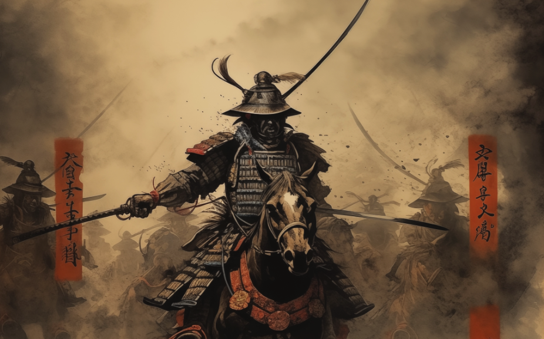
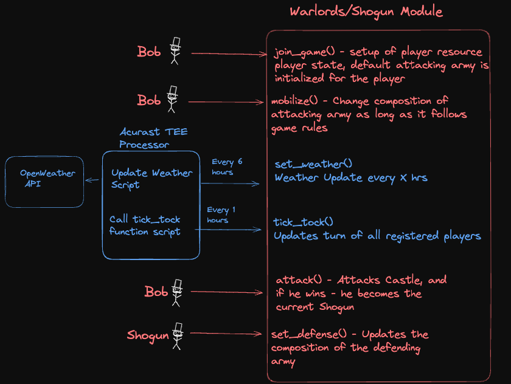
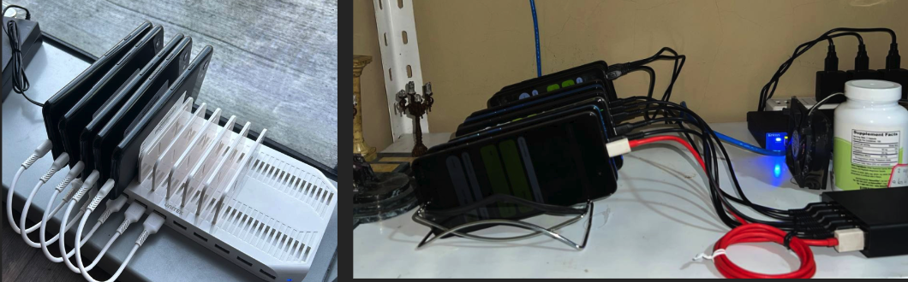

# TAIKO SHOGUN GAME



## Project Links

- **Main Repository**: [Github](https://github.com/jsmaxi/taiko_shogun_game)
- **Website**: [https://taiko-shogun-game.vercel.app/](https://taiko-shogun-game.vercel.app/)
- **Presentation**: [Slides PDF](./presentation.pdf)
- **Taiko Mainnet Contract**: [Explorer](https://taikoscan.io/address/0xA70904c7A115989E543a33a11d34B6EC74B965e7)
- **Taiko Hekla Contract**: [Explorer](https://hekla.taikoscan.io/address/0x9Fc44926b55b04028f50767dbA90F09155993b1c)
- **Sepolia Testnet Contract**: [Explorer](https://sepolia.etherscan.io/address/0xA70904c7A115989E543a33a11d34B6EC74B965e7)
- **Holesky Testnet Contract**: [Explorer](https://holesky.etherscan.io/address/0x3B8639830957A49B2A650d652059392280A41268)
- **Acurast Weather Oracle**: [Github](https://github.com/jsmaxi/taiko_weather)

Contracts are deployed and verified on Taiko mainnet and testnet, Sepolia and Holesky testnets.

## Introduction

Set in the Edo period of Japan, the goal of _Shogun_ is to seize control of Edo Castle. Real-time weather conditions in Tokyo (historically Edo) directly impact gameplay and strategy. For example, rain hinders cavalry charges but strengthens infantry, while clear skies provide a bonus to cavalry, enhancing their effectiveness in battle.

_Shogun_ is a fully on-chain game on the Taiko blockchain, built using Solidity and NextJS. The core innovations of this project include:

- **Leveraging Acurast**: We utilize [Acurast](https://docs.acurast.com) to run Node.js scripts, acting as an **oracle** for non-financial data, such as weather. Weather data is fetched from the OpenWeather API with minimal trust assumptions and influences the in-game battle mechanics. Tokyo's weather is updated every 6 hours.

- **Decentralized Keepers**: Acurast processors serve as decentralized **keepers**, executing scheduled cron jobs. In our game, player statuses are updated every hour. This mechanism can be extended to support other decentralized, turn-based games on Taiko.

- **Goldsky Subgraph**: We are planning to use Goldsky Subgraph to build our leaderboard.

## Game Architecture

The following diagram shows all the public entry functions and the oracle/keeper data flow:



The Diagram above shows the user actions, and the automated actions of Acurast processors (cron jobs):

Main Actions a Player Can Take (public entry functions called by players) are as follows:

- **Join the Game**: Upon joining the game, a player's default values are initialized in the game state. Players are provided with an army that has a default troop composition.

- **Mobilize Army**: After joining the game, players can modify the composition of their attacking army.

- **Attack Castle Edo**: Players can challenge Edo Castle. If they succeed, they become the next Shogun.

- **Set Castle Defense**: Only the current Shogun, the lord of Edo Castle, has the authority to change the troop composition of the defending army.

The scripts running in Acurast’s TEE handle the following automated tasks (public entry functions called by cron jobs):

- **Update Weather Conditions**: Fetches and updates the weather data every 6 hours.
- **Update Player State**: Updates player statuses every hour.

## Acurast Integration (Oracle and Keeper) and trust assumptions:

Acurast is a decentralized and trustless compute execution layer, leveraging Trust Execution Environments opening up the capability to have Acurast’s Processors (off-chain workers) fetch, sign and submit data on-chain completely trustless and confidential. The processors are highly decentralized and uses processing power of old mobile phones.

On decentralized system, fetching non-price feed data can be difficult. However, we believe that smart contracts can receive Web2 API data through Acurast TEE processors with minimal trust assumptions. As a result, we decided to run scripts inside Acurast processors.

For our proof of concept, we deployed nodejs script on a Acurast processor that fetches weather data from [openweathermap api](https://openweathermap.org/current). Assuming that the data from Openweather API is correct, the data is forwarded to the game smart contract (move module) without additional trust overhead. It is signed by a preassigned weatherman, verifying that the incoming data comes from the acurast processor.

The acurast data sets the weather condition to one of the following options, based on the [weather condition codes of the api](https://openweathermap.org/weather-conditions)

```solidity
    enum Weather {
        CLEAR,
        CLOUDS,
        SNOW,
        RAIN,
        DRIZZLE,
        THUNDERSTORM
    }
```

Each weather condition affects the effectiveness of the units, adding a layer of strategy to the game.

Moreover, we also use a second script to call `tickTock()` function of the module to update player states every turn. This is a proof of concept use of Acurast processors as ** decentralized keepers**. This function is not gated (anyone call this), however there is an internal check that only affects the game state if it is called after 1 hr has passed.

Note: You can find out more on Acurast's trust minimized processing [here](https://docs.acurast.com/acurast-protocol/architecture/end-to-end/)

Acurast processor clusters are highly decentralized and permissionless, allowing anyone to join and contribute, making the network more resilient and distributed. The picture below showcases various processor clusters. The one on the left represents our cluster, where our proof-of-concept scripts are currently running. In production, we plan to deploy to a randomly selected processor within the Acurast ecosystem (ones that we do not own), with multiple redundancies to further minimize trust assumptions and enhance reliability.



## Implementation details - Game rules

When a player joins the game, they start with 10 turns and a default attacking army consisting of 500 archers, 500 cavalry, and 500 infantry. Players can mobilize and modify their army composition at any time for a cost of 1 turn, with a maximum army size of 2,000 units.

Attacking Edo Castle (Tokyo) costs 3 turns. Acurast Keepers (cron jobs) ensure that players receive 1 turn every hour, with each turn representing one in-game day.

If a player wins the battle, they become the next Shogun of Tokyo, gaining the ability to set the castle's defense with an army of up to 2,000 units. Players cannot attack themselves, and each successful attack earns points, which contributes to their rank on the leaderboard.

The current Shogun can also continually adjust their defending army composition (costs 3 turns) to strengthen their hold on the castle and prolong their reign.

## Test Coverage

Our smart contract has comprehensive test coverage. We have implemented unit tests for all public entry functions, ensuring that key aspects of the game function as intended. To simulate different outcomes, we use mocks to test various conditions where either the attacker or defender wins. Additionally, we mock weather conditions to thoroughly test how battles play out under different weather scenarios.

[Tests](./foundry/test/KingOfTheCastle.t.sol)

## Future Game Enhancements

The possibilities for adding new features are endless, but the key enhancements we think would bring the most value and interest include:

- **Turn Scarcity and Purchasable Turns**: Players will only be able to attack once every 1-2 days, introducing scarcity to the game. Additionally, players will have the ability to "buy" extra turns.

- **Incentivized Attacks and Defenses**: Tokens collected from players buying turns will be distributed between the current Shogun and the treasury in a 70/30 split. This system will incentivize both attacking the castle and defending the Shogun position. Players will be encouraged to attack and hold the position of Shogun (pay-to-hold), earning rewards in the process.

- **Funding Acurast Processors**: The cACU and gas tokens are required for Acurast Processors to run the oracles and keepers. A portion of the treasury funds will be allocated to cover these operational costs.

- **Multiple Castles with Unique Weather**: We plan to add multiple castles to the game, each with weather conditions tied to its specific location. To become the Shogun, a player must hold a majority of the castles, rather than just one, adding new layers of strategy.

We plan to apply for the Taiko grant to help develop this game further.

## Quick Start (Localhost)

- Download the project
- cd into project's folder
- Create .env file by example and fill required values (project ID for wallet connect can be obtained from https://reown.com/)
- Deploy the smart contract
- Run the frontend application

```
NEXT_PUBLIC_WALLET_CONNECT_PROJECT_ID=
NEXT_PUBLIC_SEPOLIA_CONTRACT_ADDRESS=
NEXT_PUBLIC_HOLESKY_CONTRACT_ADDRESS=
NEXT_PUBLIC_TAIKO_HEKLA_CONTRACT_ADDRESS=
NEXT_PUBLIC_TAIKO_MAIN_CONTRACT_ADDRESS=
```

- Run:

```
cd nextjs
npm install
npm run dev
```

```
cd foundry
forge build
forge test
```

We used [Foundry](https://book.getfoundry.sh/) and [NextJS](https://nextjs.org/) as the starting point for our project.

## Main commands

- `npm run dev` - a command to start localhost
- `npm run build` - a command to build the frontend
- `forge build` - a command to build the smart contract
- `forge test` - a command to test the smart contract

---

Bootstrap back-end from zero:

```
forge init foundry

cd foundry

forge install OpenZeppelin/openzeppelin-contracts

forge build

forge test
```

Bootstrap front-end from zero:

```
npx create-next-app@latest

cd nextjs

npm run dev
```

---
